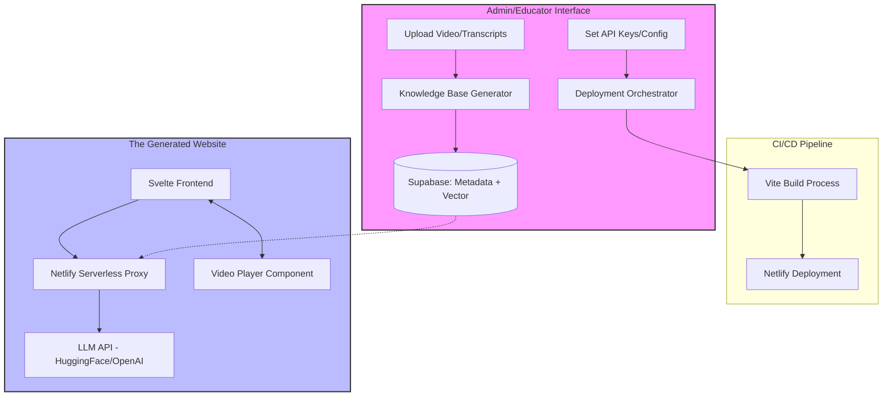

# 🚀 Project Master Specification: TutorGen (v3 - Integrated)

**Project Type:** Platform-as-a-Service (PaaS) / AI Chatbot Generator  
**Status:** Finalized Design Phase (Integrated with RAG & Data Strategy)  
**Target User:** Educators and Content Creators

---

## 1. Executive Summary

**TutorGen** is a specialized web application that automates the creation of "Context-Aware Learning Environments." It allows educators to transform raw video content and structured transcripts into a deployable, interactive website. The resulting site features an integrated video player and a "grounded" AI tutor that answers questions based strictly on the provided course content, providing clickable timestamps for seamless learning.

---

## 2. Core Product Pillars

### A. The Builder (The Generator Interface)

A dashboard where educators manage their content and configuration:

- **Content Ingestion:** Uploading video files or linking to CDNs (e.g., `b-cdn.net`).
- **Knowledge Base Generation:** A specialized pipeline that ingests `.md` and `.json` files (generated via vision/transcription tools) to build a searchable vector database.
- **AI Configuration:** Selection of LLM providers (HuggingFace, OpenAI, Anthropic) and tuning of "System Prompts" to enforce strict grounding.
- **Deployment Orchestration:** A one-click deployment workflow that builds the Svelte application and pushes it to Netlify.

### B. The Runtime (The Student Experience)

A high-performance, specialized UI for students:

- **Split-Screen Workspace:** A side-by-side layout (Video Player | Chat Interface) to prevent context switching.
- **Cinema Mode:** A toggle to expand the video player while minimizing the chat into a floating overlay.
- **Grounded AI Chat:** A chatbot that uses **RAG (Retrieval-Augmented Generation)** to ensure answers are derived only from the provided transcripts.
- **Interactive Timestamps:** "Source Chips" in the chat that, when clicked, trigger `video.currentTime` to jump the player to the exact moment of the answer.

---

## 3. Technical Architecture

### System Diagram (Mermaid)



### Tech Stack

- **Frontend Framework:** Svelte (for high-performance, reactive UI).
- **Styling:** Tailwind CSS & Shadcn UI.
- **Build Tooling:** Vite.
- **AI Orchestration:** Vercel AI SDK (to handle streaming responses).
- **Backend/Proxy:** Netlify Serverless Functions (to secure API keys and handle RAG).
- **Database:** **Supabase** (using `pgvector` for unified Metadata + Vector storage).
- **Deployment:** Netlify.

---

## 4. Data Strategy (RAG & Storage)

To ensure the AI is "grounded" and does not hallucinate, TutorGen uses a **Retrieval-Augmented Generation (RAG)** architecture.

### Database Selection: Supabase

We will use **Supabase** as the single source of truth. This avoids "data fragmentation" by using one database for both relational metadata and vector embeddings.

- **Relational Tables:** Store course titles, user settings, video URLs, and transcript text.
- **Vector Extension (`pgvector`):** Stores mathematical embeddings of the transcript segments to allow for "similarity searches."

### The RAG Workflow

1.  **Semantic Chunking:** When a video is uploaded, the system breaks transcripts into "semantic chunks" (e.g., by header or logical thought) rather than arbitrary character counts to preserve context.
2.  **Embedding:** Each chunk is sent to an embedding model (e.g., `text-embedding-3-small`) to convert text into a vector.
3.  **Storage:** The chunk + its timestamp + the vector are stored in Supabase.
4.  **Retrieval:** When a student asks a question, the system converts the _question_ into a vector and performs a similarity search in Supabase to find the most relevant chunks.
5.  **Augmentation:** The system sends only those specific chunks + the question to the LLM, providing a "grounded" context.

---

## 5. Data Schema

### A. The "Course Blueprint" (The Input)

```json
{
  "course_metadata": {
    "title": "Creative Coding 101",
    "slug": "creative-coding-101",
    "theme_color": "#ff3e00"
  },
  "ai_config": {
    "provider": "huggingface",
    "model_id": "mistralai/Mistral-7B-Instruct-v0.1",
    "temperature": 0.2,
    "system_prompt": "You are a tutor for {course_title}. Use only the provided transcripts."
  },
  "content": [
    {
      "video_id": "vid_01",
      "url": "https://aacontent.b-cdn.net/classes/creativeCode/intro.mp4",
      "transcript_segments": [
        {
          "t": 120,
          "text": "...discuss the importance of the canvas element."
        },
        { "t": 450, "text": "...use the getContext method." }
      ]
    }
  ]
}
```

### B. The "Runtime Context" (The Prompt Injection)

```json
{
  "query": "How do I use the canvas element?",
  "context_snippets": [
    { "timestamp": 120, "text": "...use the canvas element to draw..." }
  ],
  "constraints": "Answer only using the snippets. If not found, say you don't know."
}
```

---

## 6. Critical Implementation Requirements

### Security & API Management

- **Zero-Exposure Policy:** All LLM API keys must reside in Netlify Environment Variables. The client-side Svelte app **must never** communicate directly with HuggingFace/OpenAI.
- **CORS Policy:** Backend functions must be configured to only accept requests from the specific generated subdomain.

### Performance & Optimization

- **Streaming Responses:** To prevent Netlify's 10-second function timeout, the Vercel AI SDK must be used to stream LLM responses chunk-by-chunk.
- **RAG Efficiency:** The system must perform a similarity search in Supabase to retrieve only the most relevant `transcript_segments` before calling the LLM.
- **Code Splitting:** The Chat component must be dynamically imported to ensure the initial landing page load is near-instant.

### UX/UI Standards

- **Loading States:** Use animated ellipsis or "Thinking..." pulses within chat bubbles.
- **Grounded UI:** Every AI response must include a "Source Chip" (e.g., `[Video | MM:SS]`) that acts as a trigger for the video player.
- **Error Handling:** If the LLM cannot find an answer in the context, it must explicitly state: _"I cannot find this information in the course videos."_
